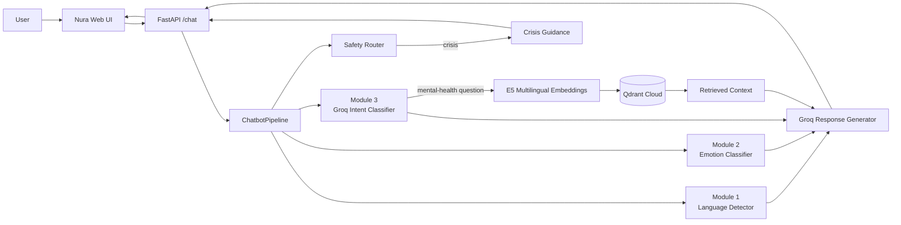

# Nura: Mental Health Support Chatbot

Nura is my end-to-end mental wellness companion: a FastAPI chatbot that combines language detection, emotion classification, intent routing, safety checks, retrieval, and LLM response generation into one usable product.

The idea is simple: the user should feel heard, get a practical next step, and receive answers grounded in mental-health resources instead of a generic chatbot response.

## What Makes It Different

- Modular pipeline instead of one opaque prompt.
- Language, emotion, and intent are detected separately and exposed in the developer UI.
- RAG is only used when the message is actually mental-health related.
- Qdrant Cloud stores two knowledge sources and supports source filtering.
- The final LLM reviews earlier model outputs before answering.
- Crisis-like messages bypass normal RAG and return immediate support guidance.
- Production UI is branded as Nura with light/dark mode, saved chats, and clickable follow-up suggestions.
- Developer UI makes the full pipeline easy to inspect and demo.

## Architecture



## Pipeline Flow

```text
User message
  -> crisis check
  -> language + emotion + intent in parallel
  -> retrieval only if intent is asking_mental_health_question
  -> final LLM review of language, emotion, and intent
  -> same-language supportive answer
```

For simple English greetings, thanks, goodbyes, and obvious standalone out-of-scope tasks, Nura uses a fast direct response and skips final LLM generation. This keeps casual turns responsive while preserving the full RAG flow for real support questions.

## End-To-End Runtime Flow

1. The browser sends the current message, selected support style, fixed `top_k=5`, and recent chat history to FastAPI.
2. FastAPI validates the request and reuses one cached `ChatbotPipeline` instance for efficiency.
3. The safety router runs first. Crisis-like messages skip normal retrieval and generation and return immediate support guidance.
4. For non-crisis messages, language detection, emotion classification, and intent classification run in parallel.
5. Simple English social messages use a fast Nura response, which keeps casual turns responsive and avoids unnecessary LLM calls.
6. If the message is a mental-health question, the multilingual E5 embedder converts the retrieval query into a vector and searches Qdrant Cloud.
7. Retrieval can search both sources or focus on one support style: Balanced Care, Learn and Cope, or Reflective Talk.
8. The final response generator receives a compact state: module outputs, recent history, and up to 5 retrieved passages trimmed for prompt efficiency.
9. The final LLM reviews language, emotion, and intent again before answering, so it can correct earlier module mistakes when needed.
10. Nura answers in the user's language, keeps a supportive tone, and only shows clickable follow-up suggestions for mental-health support answers.
11. The production UI receives only the final answer and suggestions. The developer UI can opt into the full diagnostic state for demos and debugging.

## Modules

### Module 1 - Language Detection

- Dataset: `papluca/language-identification`
- Model: character TF-IDF + Multinomial Naive Bayes
- Output: language code, language name, confidence, confidence flag
- Report: `reports/module_1_language_detection/`

### Module 2 - Emotion Classification

- Dataset: `dair-ai/emotion`
- Model: fine-tuned `distilbert-base-uncased`
- Labels: sadness, joy, love, anger, fear, surprise
- Explainability: word-occlusion impact scores
- Report: `reports/module_2_emotion_classification/`

The trained model folder is intentionally not committed:

```text
src/models/saved_emotion_model/
```

### Module 3 - Intent Classification

- Model: Groq `llama-3.1-8b-instant`
- Method: few-shot JSON classification
- Intents: greeting, goodbye, gratitude, asking_mental_health_question, out_of_scope
- Report: `reports/module_3_intent_classification/`

### Module 4 - RAG Retrieval

Knowledge sources:

- `cci`: Centre for Clinical Interventions information sheets, cleaned from PDFs into structure-aware chunks up to 400 words.
- `amod`: cleaned Q&A records from `Amod/mental_health_counseling_conversations`.

Retrieval stack:

- Embedding model: `intfloat/multilingual-e5-base`
- Vector database: Qdrant Cloud
- Production collection: `mental_health_rag_v2`
- Previous comparison collection: `mental_health_rag`

Retrieval modes:

- `both`: Balanced Care
- `cci`: Learn and Cope
- `amod`: Reflective Talk

## User Interfaces

Production UI at `/`:

- Nura branding
- light/dark theme
- local saved chats
- support style switching
- clickable suggested questions only for mental-health support answers

Developer UI at `/developer`:

- full pipeline state
- language, emotion, and intent outputs
- retrieval source switching
- top-k control
- vector index switching between `mental_health_rag_v2` and `mental_health_rag`

## Evaluation And Reports

The repository includes reports for model quality, data processing, retrieval, and integrated chatbot behavior:

- `reports/module_1_language_detection/`
- `reports/module_2_emotion_classification/`
- `reports/module_3_intent_classification/`
- `reports/module_4_rag_retrieval/`
- `reports/integrated_chatbot/`

The integrated chatbot edge-case report currently passes 12/12 cases, including follow-up messages, mixed-scope queries, multilingual stress input, crisis routing, and out-of-scope requests.

## Running Locally

Install dependencies:

```powershell
.\.venv\Scripts\python.exe -m pip install -r requirements.txt
```

Create `.env` from `.env.example` and set:

```text
GROQ_API_KEY=your_groq_api_key_here
GOOGLE_API_KEY=your_google_ai_studio_key_here
LANGUAGE_MODEL_REPO_ID=your_hf_username/language-detector-model
LANGUAGE_MODEL_FILENAME=saved_lang_model.pkl
EMOTION_MODEL_ID=your_hf_username/emotion-detector-model
QDRANT_URL=https://your-qdrant-cluster-url
QDRANT_API_KEY=your_qdrant_api_key_here
QDRANT_COLLECTION=mental_health_rag_v2
EMBEDDING_MODEL_NAME=intfloat/multilingual-e5-base
GROQ_RESPONSE_MAX_TOKENS=500
GROQ_RESPONSE_TEMPERATURE=0.55
GROQ_INTENT_MODEL=llama-3.1-8b-instant
GROQ_RESPONSE_MODEL=llama-3.1-8b-instant
GROQ_INTENT_FALLBACK_MODELS=
GROQ_RESPONSE_FALLBACK_MODELS=
GROQ_REQUEST_TIMEOUT_SECONDS=8
GROQ_MAX_RETRIES=0
GOOGLE_INTENT_MODEL=gemini-2.5-flash
GOOGLE_RESPONSE_MODEL=gemini-2.5-flash
GOOGLE_REQUEST_TIMEOUT_SECONDS=12
LLM_CONTEXT_TOP_K=5
LLM_CONTEXT_MAX_CHARS=700
LLM_HISTORY_MESSAGES=8
TORCH_NUM_THREADS=1
NURA_WARMUP_ON_START=false
NURA_WARMUP_RETRIEVAL=false
```

Start the app:

```powershell
.\.venv\Scripts\python.exe -m uvicorn src.api_app:app --host 127.0.0.1 --port 8000
```

Open:

```text
http://127.0.0.1:8000
```

## Useful Commands

Run intent evaluation:

```powershell
.\.venv\Scripts\python.exe src\models\intent_classifier.py --evaluate
```

Test retrieval:

```powershell
.\.venv\Scripts\python.exe src\retrieval\retrieval_engine.py "I feel anxious and cannot sleep" --source both --top-k 5
```

Compare retrieval indexes:

```powershell
.\.venv\Scripts\python.exe src\evaluation\compare_retrieval_chunking.py
```

Run integrated chatbot edge cases:

```powershell
.\.venv\Scripts\python.exe src\evaluation\test_chatbot_edge_cases.py
```

Benchmark integrated chatbot latency:

```powershell
.\.venv\Scripts\python.exe src\evaluation\benchmark_chatbot_latency.py --repeat 1 --source both --top-k 5
```

## Deployment

The Dockerfile uses the platform `PORT` environment variable. It defaults to `7860` for Hugging Face Spaces, while Render can still inject its own `PORT`. Secrets are expected to come from the hosting provider environment, not from Git.

Recommended Hugging Face Space secrets:

```text
GROQ_API_KEY
GOOGLE_API_KEY
QDRANT_URL
QDRANT_API_KEY
```

Recommended Hugging Face Space variables:

```text
LANGUAGE_MODEL_REPO_ID=your_hf_username/language-detector-model
LANGUAGE_MODEL_FILENAME=saved_lang_model.pkl
EMOTION_MODEL_ID=your_hf_username/emotion-detector-model
QDRANT_COLLECTION=mental_health_rag_v2
GROQ_RESPONSE_MAX_TOKENS=500
LLM_CONTEXT_TOP_K=5
LLM_CONTEXT_MAX_CHARS=700
LLM_HISTORY_MESSAGES=8
GROQ_REQUEST_TIMEOUT_SECONDS=8
GROQ_MAX_RETRIES=0
NURA_WARMUP_ON_START=false
NURA_WARMUP_RETRIEVAL=false
```

Optional variables can be omitted unless you want to override defaults: `GROQ_RESPONSE_TEMPERATURE`, `GROQ_INTENT_MODEL`, `GROQ_RESPONSE_MODEL`, `GOOGLE_INTENT_MODEL`, `GOOGLE_RESPONSE_MODEL`, and `GOOGLE_REQUEST_TIMEOUT_SECONDS`. Keep Groq fallback model lists empty unless another Groq model has been tested with the strict JSON prompts.

## Safety Note

Nura is an educational and supportive project. It does not diagnose, prescribe treatment, replace therapy, or handle emergencies as a clinical service. Crisis-like messages are routed to immediate-support guidance and should encourage contacting local emergency services or trusted support.
